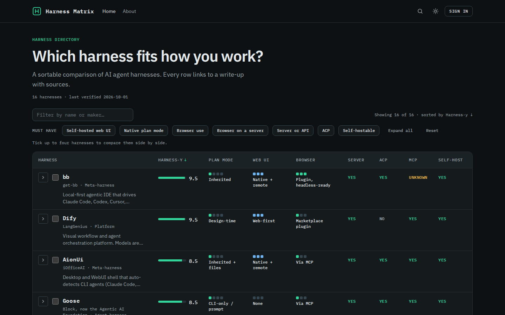
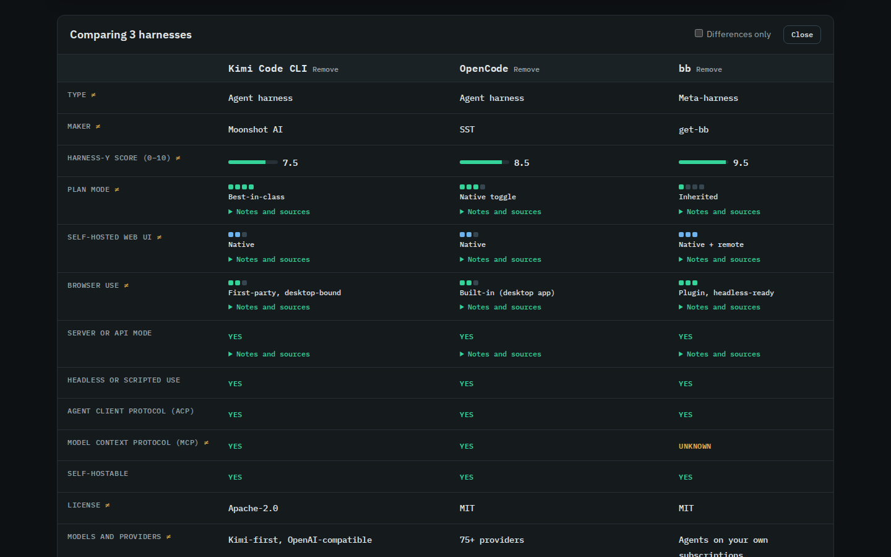
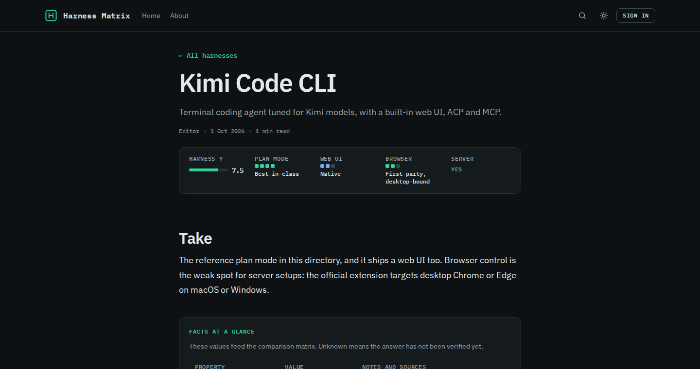

# ghost-harness

A Ghost theme for a directory of AI agent harnesses. Every harness is a normal Ghost post. The homepage turns all of them into one sortable, filterable comparison matrix, and each post gets a summary strip built from the same data.



## What you get

- A homepage matrix with search, sorting by any column, "must have" filters, and a side-by-side compare view for up to four harnesses.
- Filters, sort order and the compare selection live in the URL, so any view is a shareable link.
- A summary strip and a facts table on every harness post, plus Ghost's native comments.
- Dark and light schemes that follow the system, with a toggle.
- A readable no-JavaScript fallback.
- Sixteen seeded harnesses with sources, so the site is not empty on day one.
- Tooling: a schema with tests, a seed script, a lint for facts blocks, a Snippet generator, and GitHub Actions for tests and deployment.



## How it works

Ghost has no custom fields for posts, so the structured data lives inside each post as one small HTML block, the facts block. A Snippet in the Ghost editor inserts a blank block with one slash command. The theme asks Ghost for every post tagged with the internal tag `#harness`, reads each facts block in the browser, and builds the matrix.

The full story, including the Snippet workaround and every other trick, is in [_GUIDE.md](_GUIDE.md).



## Quick start

1. Host Ghost 6. Pick Docker Compose (Ghost, MySQL and Caddy with automatic HTTPS, in [`deploy/`](deploy/)) or Ghost's own ghost-cli installer. Both are covered step by step in [_DEPLOYMENT.md](_DEPLOYMENT.md).
2. Put the theme on the site. Either run `npm run pack` and upload `dist/ghost-harness.zip` in Ghost Admin (Settings, Site, Theme, Change theme, Upload theme), or add two GitHub secrets and let the included workflow deploy on every push.
3. Seed the directory:

```bash
npm ci
export GHOST_URL=https://harness.example.com
export GHOST_ADMIN_API_KEY=<id>:<secret>     # from a custom integration in Ghost Admin
npm run seed
```

4. Create the editor Snippet once, by hand or with `npm run snippet:sync`. Ghost will not let an integration key create Snippets, which is why this step is separate. See [_GUIDE.md](_GUIDE.md).

Step-by-step detail for all four is in [_DEPLOYMENT.md](_DEPLOYMENT.md) and [_GUIDE.md](_GUIDE.md).

## Documentation

| File | What it covers |
| --- | --- |
| [_DEPLOYMENT.md](_DEPLOYMENT.md) | Self-hosting Ghost (Docker Compose or ghost-cli), GitHub deploy, seeding, mail, comments, backups, troubleshooting |
| [_GUIDE.md](_GUIDE.md) | The Snippet workaround, daily workflow, and every trick the theme relies on |
| [_SCHEMA.md](_SCHEMA.md) | The facts block contract: fields, scales, rules, how to change the schema |

## Repository map

| Path | Contents |
| --- | --- |
| `*.hbs`, `partials/` | Ghost theme templates |
| `assets/` | CSS, JavaScript and self-hosted IBM Plex fonts |
| `assets/js/facts.js` | The schema and parser. Single source of truth, shared by browser, tests and scripts |
| `config/routes.yaml` | Optional pretty URLs (`/harness/<slug>/`) |
| `snippets/` | The generated blank facts block for the Ghost editor Snippet |
| `seed/` | Starter data for sixteen harnesses |
| `scripts/` | Seed, lint, pack, Snippet generator and Snippet sync |
| `tests/` | Unit tests for the schema, parser and Snippet payload |
| `deploy/` | Docker Compose stack for hosting Ghost |
| `.github/workflows/` | Test workflow and theme deploy workflow |

## Commands

| Command | What it does |
| --- | --- |
| `npm test` | Runs the unit tests |
| `npm run gscan` | Validates the theme with Ghost's own checker |
| `npm run snippet` | Regenerates `snippets/harness-facts.html` from the schema |
| `npm run snippet:check` | Fails if the committed Snippet is out of date (runs in CI) |
| `npm run snippet:sync` | Creates or updates the editor Snippet using a staff access token (optional) |
| `npm run seed` | Creates the seed posts through the Admin API. Supports `--dry-run`, `--update`, `--status draft` |
| `npm run lint:facts` | Checks every harness post on your site for a valid facts block |
| `npm run pack` | Builds `dist/ghost-harness.zip` for upload |
| `npm run check` | Tests, Snippet check and gscan in one go |

Scripts need Node.js 22. The theme needs Ghost 6.

## About the data

The seed data is a starting point, not an authority. Each fact carries a verification date (2026-10-01) and links to its source, but products change fast. The Harness-y score is an editorial opinion about how much a product is orchestration around swappable models or agents, and the reasoning sits next to every score. Re-verify what you depend on.

## License

Code: [MIT](LICENSE). The bundled IBM Plex fonts are licensed under the SIL Open Font License; the license texts are in [`assets/fonts/`](assets/fonts/).
